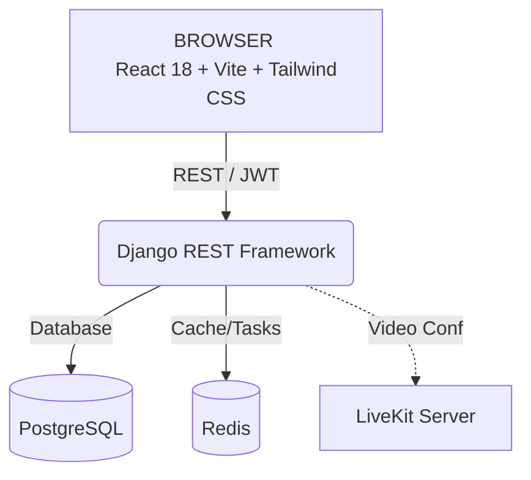

# 📖 Quranific Portal

> A production-grade academy management platform for **Quranific Academy**.

The system handles students, teachers, live virtual classrooms, attendance, payroll, payments, and role-based access control — all from a single dashboard.

---

## 📑 Table of Contents

- [Features](#-features)
- [Production Readiness](#-production-readiness)
- [Architecture](#-architecture)
- [Technology Stack](#-technology-stack)
- [Project Structure](#-project-structure)
- [Django Apps](#-django-apps)
- [User Roles (RBAC)](#-user-roles-rbac)
- [Getting Started](#-getting-started)
  - [Prerequisites](#prerequisites)
  - [1. Clone & Configure Environment](#1-clone--configure-environment)
  - [2. Start Infrastructure](#2-start-infrastructure)
  - [3. Backend Setup](#3-backend-setup)
  - [4. Frontend Setup](#4-frontend-setup)
  - [5. First Login](#5-first-login)
- [Environment Variables](#-environment-variables)
- [License](#-license)

---

## ✨ Features

- **Role-Based Access Control (RBAC):** Distinct portals and capabilities for Owners, Managers, Teachers, and Students.
- **Live Virtual Classrooms:** Integrated WebRTC-based video conferencing tailored for interactive online sessions.
- **Student & Staff Management:** Complete CRUD operations for student enrollments, guardian details, and teacher profiles.
- **Financial Operations:** Automated payroll for staff and integrated payment tracking for student fees.
- **Attendance Tracking:** Keep comprehensive records of student participation.
- **Audit Logging:** Immutable system logs tracking all critical administrative actions for full transparency.
- **Payment Idempotency:** Duplicate-safe payment creation — client-supplied idempotency key returns the original record on retry, with a race-condition guard for concurrent requests.

---

## 🔒 Production Readiness

This project has an active audit and remediation pipeline. All CRITICAL and HIGH security findings from the initial audit have been resolved; MEDIUM findings are in progress. See [`audit/`](./audit/) for the full audit reports, [`roadmap/`](./roadmap/) for the feature roadmap findings, [`fixes/LEDGER.md`](./fixes/LEDGER.md) for the complete fix-by-fix history with per-item verification evidence, and [`PROJECT_HANDOFF.md`](./PROJECT_HANDOFF.md) for a zero-context snapshot of what has been fixed, what is still open, and the operating rules for whoever continues this work.

### Pre-Deploy Checklist

For anyone deploying manually outside of the automated CI pipeline, the following checks are strictly required to ensure production safety:

1. **Migration Drift Check**: Run `python manage.py makemigrations --check --dry-run` in the `backend/` directory. If this command exits with an error or reports that migrations are missing, **do not deploy**. You must generate and commit the missing migrations first. Deploying with migration drift will cause the production database schema to fall out of sync with the application code.

---

## 🏗 Architecture



---

## 💻 Technology Stack

| Layer | Technology | Purpose |
|---|---|---|
| **Frontend** | React 18, Vite, Tailwind CSS | SPA dashboard for all user roles |
| **Backend** | Django 5, Django REST Framework | REST API, business logic, RBAC |
| **Auth** | SimpleJWT (Bearer tokens) | Stateless authentication + token blacklist on logout |
| **Database** | PostgreSQL 16 | Persistent data store |
| **Cache** | Redis 7 | Session cache, async task queue |
| **Video** | LiveKit Server (WebRTC) | Live virtual classrooms |
| **Testing** | pytest 9 / pytest-django / Factory Boy / Faker | 54-test automated suite (auth, RBAC, payments, attendance) against real Postgres |
| **Error Monitoring** | Sentry SDK 2.66 (production only) | Unhandled exception capture; disabled when `SENTRY_DSN` is unset — app runs cleanly without it |
| **Structured Logging** | python-json-logger 4 | JSON log lines with per-request UUID on every entry (injected by `RequestIDMiddleware`) |
| **AI Watchdog** | OpenAI API (planned) | Student engagement monitoring — not yet implemented |

---

## 📁 Project Structure

```text
quranific-portal/
├── .github/             # CI/CD Workflows
├── ai_bot/              # Future AI monitoring service
├── backend/             # Django Backend
│   ├── accounts/        # Auth, profiles, RBAC, payroll
│   ├── students/        # Student CRUD, payments, attendance
│   ├── log/             # System audit log
│   ├── config/          # Django settings, URLs, WSGI
│   ├── manage.py        # Django CLI
│   └── requirements.txt # Python dependencies
├── data/                # Local data storage volumes
├── frontend/            # React + Vite Frontend
│   ├── src/             # React components, pages, API layer
│   ├── public/          # Static assets
│   ├── package.json     # Node dependencies
│   └── vite.config.js   # Vite bundler config
├── livekit/             # LiveKit WebRTC Configuration
│   └── livekit.yaml     # LiveKit server settings
├── docker-compose.yml   # Postgres + Redis + LiveKit orchestrator
├── .env                 # Environment variables (not committed)
└── README.md            # Project documentation
```

---

## 🧩 Django Apps

| App | Responsibility |
|---|---|
| `accounts` | User profiles, RBAC (Owner / Head Manager / Manager / Teacher / Student), JWT login, registration, payroll engine, system access control. |
| `students` | Student CRUD, guardian info, payments, attendance tracking. |
| `log` | Immutable system audit log — tracks all administrative actions. |

---

## 🔐 User Roles (RBAC)

| Role | Portal | Access Level |
|---|---|---|
| `owner` | **Super Admin** | Full system access, payroll management, and strict access control configuration. |
| `head_manager` | **Academic Manager** | Management of teachers and students across the academy. |
| `manager` | **Support Staff** | Limited management and support functions. |
| `teacher` | **Ustad** | Access to assigned students, own salary records, and live teaching classes. |
| `student` | **Talib** | View own academic records, attendance, and join live classes. |
| `parent` | **Guardian** | View own children's academic records, attendance, and payment history. Accounts are admin-created only — no public self-registration. |

---

## 🚀 Getting Started

### Prerequisites

Ensure you have the following installed on your local machine:
- **Node.js** v18+
- **Python** v3.10+
- **Docker** and **Docker Compose**

### 1. Clone & Configure Environment

```bash
git clone <repo-url> quranific-portal
cd quranific-portal
cp .env.example .env   # or copy .env and edit values
```

Edit `.env` with your secrets. For local development, the defaults usually work out of the box.

### 2. Start Infrastructure

Initialize the required services (Postgres, Redis, LiveKit) via Docker:

```bash
docker compose up -d
```

Verify all three containers are healthy:

```bash
docker compose ps
```

### 3. Backend Setup

```bash
cd backend
python -m venv venv

# Activate Virtual Environment (Windows)
venv\Scripts\activate

# Activate Virtual Environment (macOS / Linux)
source venv/bin/activate

# Install dependencies and migrate
pip install -r requirements.txt
python manage.py migrate

# Create the initial admin user
python manage.py createsuperuser

# Start the server
python manage.py runserver
```

> **Note:** The API is now live at `http://localhost:8000`.

### 4. Frontend Setup

Open a new terminal window:

```bash
cd frontend
npm install
npm run dev
```

> **Note:** The dashboard is now live at `http://localhost:5173`.

### 5. First Login

1. Open `http://localhost:5173` in your browser.
2. Log in with the superuser credentials you just created.
3. Go to `http://localhost:8000/admin/` and set your profile's `user_type` to `owner` for full access to the portal features.

---

## ⚙️ Environment Variables

All variables are documented in the `.env` file at the project root. Key variables include:

> ⚠️ **Production values:** The `LIVEKIT_API_KEY`, `LIVEKIT_API_SECRET`, `REDIS_PASSWORD`, `POSTGRES_PASSWORD`, and `DJANGO_SECRET_KEY` values shown below are **local-dev placeholders only**. They must be generated fresh (e.g. via OCI Vault or a secrets manager) before any production deployment. **Never copy local `.env` values to OCI.** The `.env` file itself contains deployment reminders in the comments above each section.

| Variable | Default | Description |
|---|---|---|
| `DJANGO_SECRET_KEY` | (insecure fallback) | Django cryptographic key — **must change in production** |
| `DJANGO_DEBUG` | `True` | Set to `False` in production |
| `DJANGO_ALLOWED_HOSTS` | `*` | Comma-separated hostnames |
| `POSTGRES_DB` | `quranific` | Database name |
| `POSTGRES_USER` | `postgres` | Database user |
| `POSTGRES_PASSWORD` | `postgres` | Database password |
| `POSTGRES_HOST` | `127.0.0.1` | Database host |
| `POSTGRES_PORT` | `5432` | Database port |
| `JWT_ACCESS_TOKEN_LIFETIME_DAYS` | `1` | Access token expiry |
| `JWT_REFRESH_TOKEN_LIFETIME_DAYS` | `7` | Refresh token expiry |
| `LIVEKIT_API_KEY` | `devkey` | LiveKit API key |
| `LIVEKIT_API_SECRET` | `secret` | LiveKit API secret |
| `LIVEKIT_URL` | `ws://localhost:7880` | LiveKit WebSocket URL |
| `STRIPE_PUBLIC_KEY` | — | Stripe publishable key |
| `STRIPE_SECRET_KEY` | — | Stripe secret key |

---

## 📄 License

**Private** — Quranific Academy. All rights reserved.
